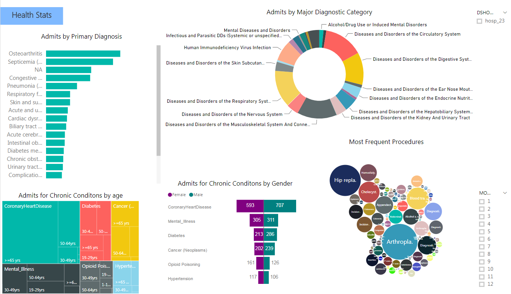
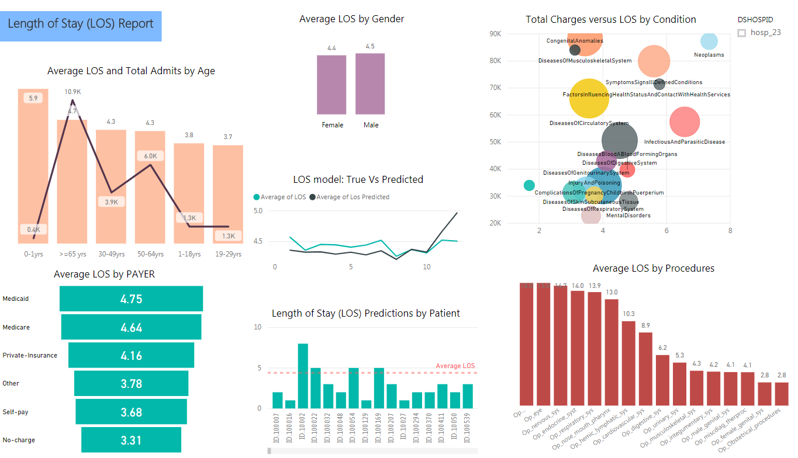

# Population Health Management

In this post I will talk about Population Health Management and present a Population Health Report using HCUP's in-patient data from hospitals. With the healthcare spending crossing $3.5 trillion and accounting for 17.9 percent of the Gross Domestic Product, there is an urgent need to bring down costs and improve outcomes. Population Health Management is an important tool that is increasingly being used by health care providers to manage and control the escalating costs. The crux of Population Health Management is to use data to improve health outcomes. Tracking, monitoring and bench marking are the three bastions of Population Health Management, aimed at improving clinical and health outcomes while managing and reducing cost.

Be leveraging heath data, Population Health Management can align patient needs with what healthcare systems provide. However in order to truly do Population Health Management we need comprehensive health data. Health data that provides a complete view of a patient’s care throughout their entire patient care experience. Unfortunately health data is fragmanted between claims data, clinical data, prescription drug data etc. making it difficult to aggregate into a cohesive view of the care provided, a key to improving the quality of care. 

For this Population Health Management report, I will be leveraging clinical and socioeconomic in-patient data generated by the hospitals from [HCUP](https://www.hcup-us.ahrq.gov/). Hospital care accounts for 33% of the nation's health dollar spending. By analyzing the patient population to gain insight into the socioeconomic, demographics, and overall medical condition of the patients across different geographic regions, health care providers can better understand the quality of care being provided and identify areas for improvement and cost savings. Hospitals can use these reports to optimize care management systems and focus their clinical resources on patients with more urgent need. Understanding the communities they serve through population health reporting can help hospitals transition from fee-for-service payments to value-based care while reducing costs and providing better care. 
  

### About HCUP Data
Healthcare Cost and Utilization Project ([HCUP](https://www.hcup-us.ahrq.gov/)) is a group of healthcare databases that contain the largest collection of longitudinal hospital care data in the United States. HCUP captures information extracted from administrative data (billing records) after a patient is discharged from the hospital, and it contains clinical and nonclinical information on all patients regardless of payer. The schema includes socioeconomic demographic data such as age, gender, income, zip code, payer type, information on admission and discharge, various diagnosis, procedures, charges, a total of about 600 columns. The Population Health Report presented here can be recreated for HCUP data for your state easily. The code to read HCUP data can be found in this notebook [here](https://github.com/Azure/cortana-intelligence-population-health-management/blob/master/Azure%20Data%20Lake/ManualDeploymentGuide/Model/ReadHCUPdata.ipynb) and a data sample can be found [here](https://github.com/Azure/cortana-intelligence-population-health-management/tree/master/Azure%20Data%20Lake/ManualDeploymentGuide/Model/SampleHCUPdata). 

Using Power BI, I have created some example reports showing the types of summarization and tracking we can do with this kind of data. These reports shed light on the quality of care being provided and allows monitoring and bench-marking of critical metrics and provide actionable intelligence. Some of the reports that I have created are Patients Stats, Health Stats, Length of stay report, Cost report, Intervention Profile and Readmission Tracking. I will describe these reports briefly below. The Power BI report can be downloaded from [here](https://github.com/Azure/cortana-intelligence-population-health-management/tree/master/Azure%20Data%20Lake/ManualDeploymentGuide/Visualization) and instructions on how to put together and deploy from the ground up a population Health Management solution using Azure can be found [here](https://github.com/Azure/cortana-intelligence-population-health-management/tree/master/Azure%20Data%20Lake/ManualDeploymentGuide)

## Patient Stats

In the Patient stats report, I have created a snapshot of the patient population. We look at Total Admits by Age, Gender, Race, Income, Admit Type, Payer Type, Total Admits and Total Charge by Payer. Such demographic breakdown of the population can help the hospitals better understand and serve their patients' unique needs. The selectors on the right-hand side of the report allow us to compare results across different hospitals and over time. We also track Total Admits, Average Charge per day, Average Charge per admit, Readmission Rate, Average Length of stay across different hospitals and over time.

## Health Stats

In the Health stats report, I have created an overview of the medical condition of the patient population. Knowing which diagnosis and procedures are most frequent at a given hospital can help with resource planning for both personnel and inventory management. In this report, we look at Total Admits by Primary Diagnosis, by MDC (Major Diagnostic Category) and by Most Frequent Procedures Performed. We also look at Total Admits for Chronic Conditions, broken down by Age and Gender.

## Length of stay report

With standardized payments hospitals are incentivized now more than ever to promote shorter stays. They are hard pressed to use resources more efficiently and find ways to accommodate more patients with the same volume of resources. In the length of stay report, we display the average length of stay by payer type, gender, age and procedures. We also look at variation in average length of stay by condition (diagnosis) and the associated average total charge. An insight into the conditions and demographic subgroups with the longest length of stay can help hospitals devise measures to reduce the average length of stay. A comparison across different hospitals can also help identify best practices or lack thereof around ensuring am optimal length of stay.

## Cost report

In the Cost report we get insights into how costs are distributed across different segments of the population (e.g. patient age, disease and payer type). We look at Total Charges by Payer and Gender as well as the total charge per day broken down by payer type. 
It’s a known fact that The majority of total health care expenses come from a small percent of the total population. Insights like these can enable us to drill down and investigate the factors contributing to the majority of the costs.

And its evident in the data. The xaxis is the amount billed and these are in bins..10k-20k, 20k-30k…100k-250k, 500k,700k) The length of the bar indicates the number of patients, the number of patients that were billed that amount.The color saturation of the bar indicates the % of total charges came from  these patients. If you look at this bar. 27% of the total charge came from just 10% of the patients..

Insights like these can enable us to drill down and investigate the population contributing to the majority of the costs.
We also identify the most expensive health conditions and calculate mean hospital costs per day per visit.

Total cost by condition.

The length of the bar indicates the total amount spent on treating patients with these condition…the most $$ were spent on treating patients for osteoarthritis followed by speticimia..The color of the bar indicates the av los for that condition.

On the right we have the total cost per admit for different conditions. A comparison of cost per admit across different hospitals can be helpful in identifying why it costs more at one hospital as compared to another.

 

Chronic diseases as I mentioned earlier we know are the leading causes of death and disability in the United Statesref and treating them incurs a huge economic burdenref. Eighty-six percent of all health care spending in 2010 was spent on people with one or more chronic medical conditionsref. In this report, we look at total costs and also what proportion of total costs went towards treating patients with chronic disease. Reduction by even a few percent could result in millions of dollars in savings.

Readmissions increase hospital costs by billions of dollars. According to the Agency for Healthcare Research and Quality, $41.3 billion was spent by hospitals between January and November 2011 to treat readmission patientsref. In this report, we look at the costs associated with readmissions for each hospital.
## Intervention Profile

## Readmission Tracking

